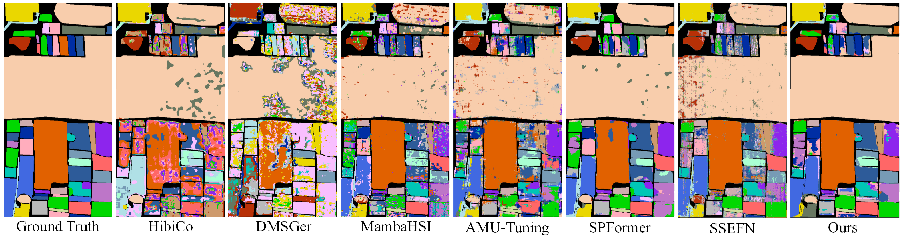
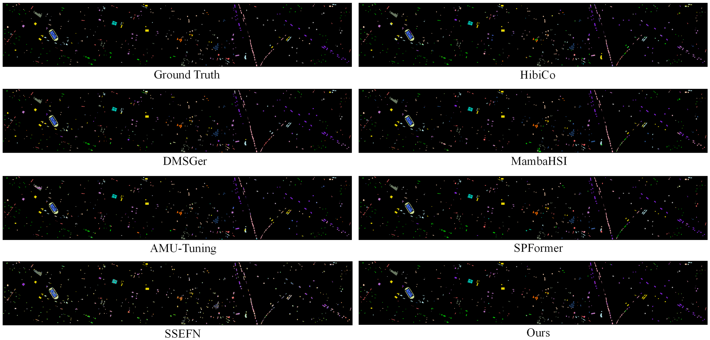
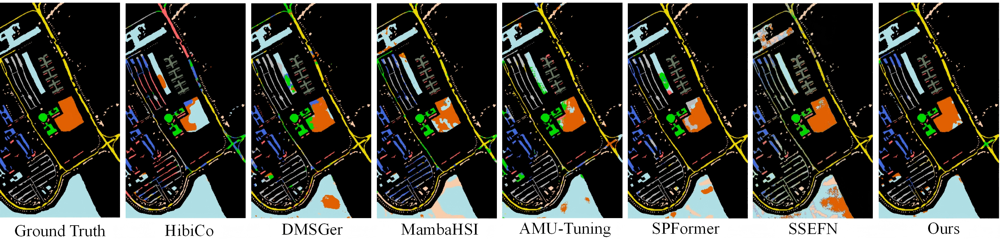

<h2>
<p align="center">
    <a><font color=yellow>Anchoring and Deviation: Language-Guided  Dual-Granularity Learning for Few-Shot Hyperspectral Image Classification</font></a>
</p>
</h2>

<p align="center">
  <b>Paper Link(Waiting for Peer Review)</b>
</p>

## Contents
- [Download and Environment](#download-and-environment)
- [File Architecture](#file-architecture)
- [Dataset and Pretrained](#dataset-and-pretrained)
- [Training](#training)
- [Visualizations](#visualizations)

## Download and Environment
1. Clone this repo:
```shell
git clone https://github.com/xiayang124/LDL-HSI.git
```

2. Create environment
```shell
conda create -n LDL-HSI python=3.13
conda activate LDL-HSI
```

3. Install the version of **pytorch >= 2.7**, which **requires 3.9 <= python <= 3.13 or 3.14 (if you use pytorch 2.9 or greater)**. You can download it using the official PyTorch command provided below. We have proved that LDL-HSI can be run with pytorch 2.11 with cuda 13.0, and at least require for 16 GB VRAM.

```shell
pip install torch==2.7.1 torchvision==0.22.1 torchaudio==2.7.1 --index-url https://download.pytorch.org/whl/cu126
```

4. There are some other important libraries need to be install:
```shell
pip install torch==2.7.1 numpy scikit-learn tqdm ftfy regex scipy
```

## File Architecture
```text
LDL-HSI
|- config/ (Training Setting)
|    |- Honghu.json
|    |- ...dataset.json
|- data/
|    |- Honghu.mat
|    |- Honghu_gt.mat
|    |- ...dataset.mat
|    |- ...dataset_gt.mat
|- model_save/
|    |- Honghu_text_token.pt
|    |- ...dataset_text_token.pt
|- result/
|- src/
|    |- engine/
|    |    |- config.py             (Convert the config to Dataclass)
|    |    |- datasets.py           (Data pre process and chunk process)
|    |    |- evals.py              (Evaluate the classification result)
|    |    |- setting_model.py      (Init model and optimizer)
|    |    |- train.py              (Train the model)
|    |- extract_text/         (Same as CLIP repo except text_process.py)
|    |- logger/
|    |    |- log.py                (Log class)
|    |- model/
|    |    |- SVAFormer.py          (Baseline)
|    |    |- LDLHSI.py             (Core model)
|    |- CONSTANT.py                (Class description)
|    |- train_begin.py             (Training entry)
|    |- utils.py
|- README.md
```

## Dataset and Pretrained
1. ***Houston 2013*** dataset can be found in [this website](https://machinelearning.ee.uh.edu/2013-ieee-grss-data-fusion-contest/). However, the download page appears to be **unavailable**.

2. ***Pavia University*** dataset can be found in [this website](https://www.ehu.eus/ccwintco/index.php?title=Hyperspectral_Remote_Sensing_Scenes). However, the download page appears to be **unavailable** too...I don't know why...

3. ***WHHL-Hi-Honghu*** dataset can be found in [this website](https://rsidea.whu.edu.cn/resource_WHUHi_sharing.htm).

4. Pretrained CLIP Text Encoder parameter can be found in [this website(ViT-L-14)](https://openaipublic.azureedge.net/clip/models/b8cca3fd41ae0c99ba7e8951adf17d267cdb84cd88be6f7c2e0eca1737a03836/ViT-L-14.pt) or clip.py will download the request pretrained version automaticly.

## Training
>Note: The warning of "build_model" can be ignored.
1. Insure the setting in ***Honghu/Houston/PaviaU.json*** is correct.

2. Run the **train_begin.py**:
```shell
python src/train_begin.py --dataset="Honghu"
```
dataset can be "Honghu", "PaviaU" and "Houston".

## Visualizations
### Honghu:
<td></td>

### Houston:
<td></td>

### PaviaU:
<td></td>
